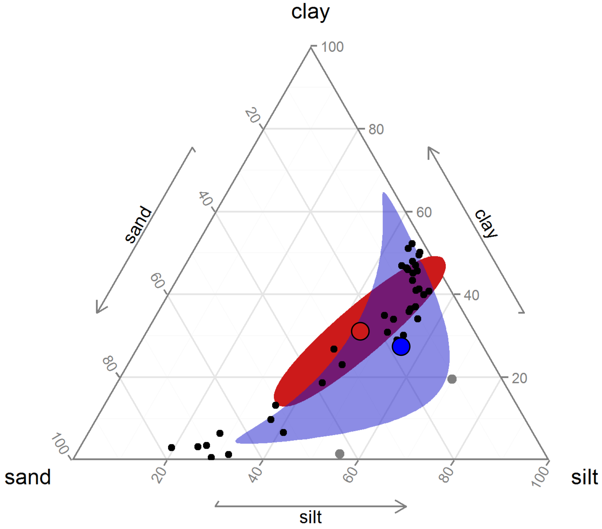
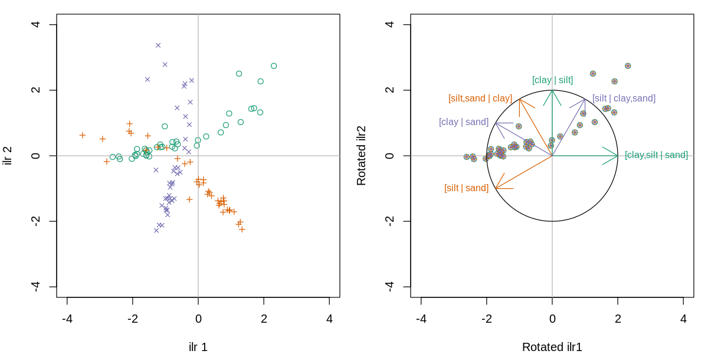

# L'analyse compositionnelle

```{r fig.align="center", echo = FALSE}
knitr::include_graphics("https://media.giphy.com/media/frijtwtnqA9RC/giphy.gif")
```

Non-non, Bugs. Nous n'allons pas composer de la musique, mais apprendre à transformer des données qui font partie d'un tout.

```{r fig.align="center", echo = FALSE}
knitr::include_graphics("https://media.giphy.com/media/zbzyZ1E8W4IGA/giphy.gif")
```

Oh non, Bugs. Nous n'allons pas travailler sur la portée, mais bien en langage R. Par ailleurs, les fichiers de calculs qui génèrent ces notes sont [disponibles sur GitHub](https://github.com/essicolo/workshop-2019-colloque-cef).

## Contexte

En 1898, le statisticien Karl Pearson nota que des corrélations étaient induites lorsque l'on effectuait des ratios par rapport à une variable commune.

```{r pearson1898, out.width="50%", fig.align="center", fig.cap="Source [Karl Pearson, 1897. Mathematical contributions to the theory of evolution.—on a form of spurious correlation which may arise when indices are used in the measurement of organs. Proceedings of the royal society of London](https://royalsocietypublishing.org/doi/pdf/10.1098/rspl.1896.0076)", echo = FALSE}
knitr::include_graphics("images/00_pearson1897.png")
```

Faisons l'exercice! Nous générons au hasard 1000 données (comme le proposait Pearson) pour trois dimensions: le fémur, le tibia et l'humérus. Ces dimensions ne sont pas générées par des distributions corrélées.

```{r bivar-os, out.width="100%", fig.align="center", fig.cap="Représentation bivariées de longueur fictives des os, générées au hasard."}
library("tidyverse")
set.seed(3570536)
n <- 1000
bones <- tibble(femur = rnorm(n, 10, 3),
                tibia = rnorm(n, 8, 2),
                humerus = rnorm(n, 6, 2))
plot(bones)
cor(bones)
```

Pourtant, si j'utilise des ratios allométriques avec l'humérus comme base,

```{r}
bones_r <- bones %>% 
  transmute(fh = femur/humerus,
            th = tibia/humerus)
plot(bones_r)
text(30, 20, paste("corrélation =", round(cor(bones_r$fh, bones_r$th), 2)), col = "blue")
```

```{r fig.align="center", echo = FALSE}
knitr::include_graphics("https://media.giphy.com/media/119bUfqfRYS0Ao/giphy.gif")
```

Pas de panique, Bugs. Nous avons induit ce que Pearson appelait une fausse corrélation (*spurious correlation*). En 1960, [Chayes](https://doi.org/10.1029/JZ065i012p04185) proposa que ces fausses corrélations soient induites non seulement sur des ratios de valeurs absolues, mais aussi sur des ratios d'une somme totale. Par exemple, dans une composition simple de deux types d'utilisation du territoire, si une proportion augmente, l'autre doit nécessairement diminuer.

```{r coda-2var, out.width="100%", fig.align="center", fig.cap="Complémentarité intrinsèque des données compositionnelles."}
n <- 30
tibble(A = runif(n, 0, 1)) %>%
  mutate(B = 1 - A) %>%
  ggplot(aes(x=A, y=B)) +
  geom_point() +
  coord_equal()
```

## Les données compositionnelles

Les variables exprimées relativement à une somme totale sont dites *compositionnelles*. Les variables compositionnelles peuvent être des concentrations, des décomptes, des dimensions (aires ou volumes), des masses, des dépenses monétaires: en fait, tout ce qui s'exprime en proportions d'un tout. Elles possèdent les caractéristiques suivantes.

1. **Redondance d'information**. Un système de deux proportions ne contient qu'une seule variable du fait que l'on puisse déduire l'une en soutrayant l'autre de la somme totale. Un vecteur compositionnel contient de l'information redondante. Pourtant, effectuer des statistiques sur l'une plutôt que sur l'autre donnera des résultats différents.
2. **Dépendance d'échelle**. Les statistiques devraient être indépendantes de la somme totale utilisée. Pourtant, elles différeront sur l'on utilise par exemple, une proportion des mâles d'une part et des femelles d'autre part, ou la proportion de la somme des deux, de même que les résultats d'un test sanguin différera si l'on utilise une base sèche ou une base humide.
3. **Distribution théorique des données**. Étant donnée que les proportions sont confinées entre 0 et 1 (ou 100%, ou une somme totale quelconque), la distribution normale (qui s'étend de -∞ à +∞) n'est souvent pas appropriée. On pourra utiliser la distribution de Dirichlet ou la distribution logitique-normale, mais d'autres approches sont souvent plus pratiques.

Pour illustrer l'effet de la distribution, voyons un diagramme ternaire incluant le sable, le limon et l'argile. En utilisant des écart-types univariés, nous obtenons l'ellipse en rouge, qui non seulement représente peu l'étalement des données, mais elle dépasse les bornes du triangle, admettant ainsi des proportions négatives. En bleu, la distribution logistique normale (issue des méthodes présentées plus loin dans cette section) convient davantage.

```{r ternaire-sd, out.width="50%", fig.align="center", fig.cap="Représentation ternaire d'un écart-type multivarié biaisé (rouge) et non-biaisé (en bleu).", echo = FALSE}

```

Les conséquences d'effectuer des statistiques linéaires sur des données compositionnelles brutes peuvent être majeures. En outre, [Pawlowksy-Glahn et Egozcue (2006)](http://dx.doi.org/10.1144/GSL.SP.2006.264.01.01), s'appuyant en outre sur Rock (1988), note les problèmes suivants (exprimés en mes mots).

1. les régressions, les regroupements et les analyses en composantes principales peuvent avoir peu ou pas de signification
2. les propriétés des distributions peuvent être générées par l'opération de fermeture de la composition (s'assurer que le total des proportions donne 100%)
3. les résultats d'analyses discriminantes linéaires sont propices à être illusoires
4. tous les coefficients de corrélation seront affectés à des degrés inconnus
5. les résultats des tests d'hypothèses seront intrinsèquement faussés

Pour contourner ces problèmes, il faut d'abord aborder les données compositionnelles pour ce qu'elles sont: des données intrinsèquement multivariées. Elles sont un nuage de point multidimensionnel, et non pas une collection de variables individuelles. Ceci qui n'empêche pas d'effectuer des analyses consciencieusement sous des angles particuliers.

Chargeons le module **`compositions`** (n'oubliez pas de l'installer au préalable) pour accéder à des données fictives de proportions de sable, limon et argile dans des sédiments. Notez que j'utiliserai la programmation en pipelines typique de **`tidyverse`**.

```{r, message=FALSE, warning=FALSE}
library("compositions")
data("ArcticLake")
ArcticLake <- ArcticLake %>% as_tibble()
head(ArcticLake)
```

En R, on pourra aisément rapporter une composition en somme unitaire grâce à la fonction `base::apply()`. Pour information, la fonction `base::apply()` *applique* la fonction `FUN = x/sum(x)` pour toutes les lignes (`MARGIN = 1`, pour les colonnes, ce serait `MARGIN = 2`). Les résultats étant rendus sous forme de colonne, on doit finalement transposer (`base:t()`).

```{r}
comp <- ArcticLake %>%
  dplyr::select(-depth) %>%
  apply(., MARGIN = 1, FUN = function(x) x/sum(x)) %>%
  t(.)
```

Plus simplement, pourra aussi utiliser la fonction `compositions::acomp()` (*acomp* pour Aitchison-composition) pour fermer la composition à une somme de 1.

```{r}
comp <- ArcticLake %>%
  dplyr::select(-depth) %>%
  acomp(.)
comp[1:6, ]
```

Cette stratégie a pour avantage d'attribuer à la variable `comp` la classe `acomp`, qui automatise les opérations dans l'espace compositionnel (que l'on nomme aussi le *simplex*). Notamment, la représentation ternaire est souvent utilisée pour présenter des compositions. Toutefois, il est difficile d'interpréter les compositions de plus de trois parties. La classe `acomp` automatise aussi la représentation teranaire.

```{r tern-arcticlake, out.width="100%", fig.align="center", fig.cap="Représentation ternaire d'une composition granulométrique."}
plot(comp)
```

## Les transformations compositionnelles

Afin de transposer cet espace clôt entre 0 et 1 en un espace ouvert de $-\infty$ à $+\infty$, on pourra diviser chaque proportion par une proportion de référence choisie parmi n'importe quelle proportion. Du coup, on retire une dimension redondante! En utilisant le log du ratio, l'inverse du ratio ne sera qu'un changement de signe, ce qui est pratique en statistiques linéaries. Cette solution, proposée par Aitchison (1986), est valide peu importe le nombre d'éléments formant la compositions. Pour une composition de $A$, $B$, $C$, $D$ et $E$:

$$alr_A = log \left( \frac{A}{E} \right), alr_B = log \left( \frac{B}{E} \right), alr_C = log \left( \frac{C}{E} \right), alr_D = log \left( \frac{D}{E} \right)$$

Dans R, la colonne de référence est par défaut la **dernière colonne de la matrice des compositions**.

```{r}
add_lr <- alr(comp)
```

Cette dernière stratégie se nomme les **log-ratios additifs** ($alr$ pour *additive log-ratio*). Bien que valide pour effectuer des tests statistiques, cette stratégie a le désavantage de dépendre de la décision arbitraire de la composante à utiliser au numérateur. Deuxième restriction des *alr*: les axes de l'espace des *alr* n'étant pas orthogonaux, ils ne peuvent pas être utilisés pour effectuer des statistiques basées sur les distances euclidiennes étant donnée que la distance entre les points dépend de la variable choisie comme dénominateur commun.

```{r}
add_lr_switch <- alr(comp[, c(2, 3, 1)])
dist(unclass(add_lr[1:6, ]), method = "euclidean")
dist(unclass(add_lr_switch[1:6, ]), method = "euclidean")
```

Les statistiques linéaires sont toutefois les mêmes peu importe le dénominateur commun: elles seront seulement exprimées selon les axes définis par la composition de référence (dénominateur commum).

Une stratégie proposée par Aitchison qui permet la mesure de distances euclidienne est d'effectuer un log-ratio entre chaque composante et la moyenne géométrique de toutes les composantes. Cette transformation se nomme le **log-ratio centré** ($clr$, pour *centered log-ratio*)

$$clr_i = log \left( \frac{x_i}{g \left( x \right)} \right)$$

En R,

```{r}
cen_lr <- clr(comp)
```

Avec des CLRs, les distances sont valides. Mais... nous restons avec le problème de la redondance d'information. En fait, la somme de chacunes des lignes d'une matrice de clr est de 0. Pas très pratique lorsque l'on effectue des statistiques incluant une inversion de la matrice de covariance (distance de Mahalanobis, géostatistiques, etc.)

```
cen_lr %>%
  cov() %>%
  solve()
 Error in solve.default(.) : le système est numériquement singulier : conditionnement de la réciproque = 4.44407e-17
```

Enfin, une autre méthode de transformation développée par Egoscue et al. (2003), les log-ratios isométriques (ou *isometric log-ratios, ilr*) projette les compositions comprenant D composantes dans un espace restreint de D-1 dimensions orthonormées. Ces dimensions doivent doivent être préalablement établie dans un dendrogramme de bifurcation, où chaque composante ou groupe de composante est successivement divisé en deux embranchement. La manière d'arranger ces balances importe peu, mais on aura avantage à créer des balances interprétables.

Le diagramme de balances peut être encodé dans une partition binaire séquentielle (ou *sequential bianry partition, sbp*). Une *sbp* est une matrice de contrastes orthogonaux ou chaque ligne représente une partition entre deux variables ou groupes de variables. Une composante étiquettée `+1` correspondra au groupe du numérateur, une composante étiquettée `-1` au dénominateur et une composante étiquettée `0` sera exclue de la partition ([Parent et al., 2013](http://dx.doi.org/10.3389/fpls.2013.00039)). J'ai reformulé la fonction CoDaDendrogram pour que l'on puisse ajouter des informations intéressantes sur les balants horizontaux. Cette fonction est disponible sur github.

```{r  coda-dendrogram, out.width="100%", fig.align="center", fig.cap="Dendrogramme compositionnel: de la surface (rouge) vers la profondeur (bleu)."}
source("https://raw.githubusercontent.com/essicolo/AgFun/master/codadend2.R")

sbp <- matrix(c(1, 1,-1,
                1,-1, 0),
              byrow = TRUE,
              ncol = 3)

CoDaDendrogram2(comp,
                V = gsi.buildilrBase(t(sbp)),
                ylim = c(0, 1),
                equal.height = TRUE,
                type = "boxplot",
                group = cut(ArcticLake$depth, 3))
```

Si la SBP est plus imposante (la précédente n'a que trois composantes, mais en pratique il y en a souvent davantage), il pourrait être plus aisé de monter dans un chiffrier, puis de l'importer dans R via un fichier csv.

Le calcul des ILRs est effectué comme suit.

$$ilr_j = \sqrt{\frac{n_j^+ n_j^-}{n_j^+ + n_j^-}} log \left( \frac{g \left( c_j^+ \right)}{g \left( c_j^+ \right)} \right)$$

où, à la ligne $j$ de la SBP, $n_j^+$ et $n_j^-$ sont respectivement le nombre de composantes au numérateur et au dénominateur, $g \left( c_j^+ \right)$ est la moyenne géométrique des composantes au numérateur et $g \left( c_j^- \right)$ est la moyenne géométrique des composantes au dénominateur.

Les balances sont conventionnellement notées `[A,B | C,D]`, ou les composantes `A` et `B` au dénominateur sont balancées avec les composantes `C` and `D` au numérateur. Une balance positive signifie que la moyenne géométrique des concentrations au numérateur est supérieur à celle au dénominateur, et inversement, alors qu'une balance nulle signifie que les moyennes géométriques sont égales (équilibre). Ainsi, en modélisation linéaire, un coefficient positif sur `[A,B | C,D]` signifie que l'augmentation de l'importance de `C` et `D` comparativement à `A` et `B` est associé à une augmentation de la variable réponse du modèle.

En R,

```{r}
iso_lr <- ilr(comp, V = gsi.buildilrBase(t(sbp)))
```

Notez la forme `gsi.buildilrBase(t(sbp))` est une opération pour obtenir la matrice d'orthonormalité à partir de la SBP.

Les ILRs sont des balances multivariées sur lesquelles on pourra effectuer des statistiques linéaries. Bien que l'interprétation des résultats comme collection d'interprétations sur des balances univariées pourra être affectée par la structure de la SBP, ni les statistiques linéaires multivariées, ni la distance entre les points ne seront affectés. En effet, chaque variante de la SBP est une rotation (d'un facteur de 60°) par rapport à l'origine:

```{r}
source("lib/ilr-rotation-sbp.R")
```

```{r ilr-rotation, out.width="100%", fig.align="center", fig.cap="Rotation des axes obtenus selon trois SBP différentes.", echo = FALSE}

```

En somme, la transformation par log-ratio consiste à exploser les données dans un espace libéré des contraintes compositionnelles.

```{r fig.align="center", echo = FALSE}
knitr::include_graphics("https://media.giphy.com/media/24FCRwxlrG5oENbaju/giphy.gif")
```

C'est exactement ça, Bugs!

Pour les transformations inverses, c'est-à-dire pour passer de données transformées à des données exprimées dans l'échelle originale, vous pourrez utiliser les fonctions `alrInv`, `clrInv` et `ilrInv`. Dans tous les cas, si vous tenez à garder la trace de vos données dans leur format original, vous aurez avantage à ajouter à votre vecteur compositionnel la valeur de remplissage, constitué d'un amalgame des composantes non mesurées. Par exemple,

```{r}
pourc <- c(N = 0.03, P = 0.001, K = 0.01)
acomp(pourc) # vous perdez la trace des proportions originales
```

```{r}
pourc <- c(N = 0.03, P = 0.001, K = 0.01)
Fv <- 1 - sum(pourc)
comp <- acomp(c(pourc, Fv = Fv))
comp
```

```{r}
iso_lr <- ilr(comp) # avec une sbp par défaut
ilrInv(iso_lr)
```

## Les zéros

Les proportions négatives ou plus imposantes que le tout sont exclues. De même, une proportion de 100%, occupant tout le simplex, implique que les proportions complémentaires soient nulles. Or, le log de 0 est $-\infty$, ce qui dispose de la possibilité d'effectuer des transformations logarithmiques. En fait, les données compositionnelles sont exprimées *entre* 0 et la somme totale, ce qui exclut la possibilité d'obtenir des proportions de 0% ou de 100%. Or, il arrive souvent qu'un tableau de données inclut des 0. Dans ce cas, on doit mener une réflexion sur la nature des valeurs nulles.

### Les zéros arrondis

Arrondissez 0.01 à une seule décimale et vous obtiendrez 0.0. Ou bien, mesurez une concentration de 0.01 avec un appareil dont le seuil de détection est 0.1, vous obtiendrez encore 0.0. Étant des valeurs qui ne peuvent être observées pour des raisons méthodologiques, les zéros arrondis sont équivalents à des valeurs manquantes non aléatoires ([Martin-Fernandez et al., 2011](https://onlinelibrary.wiley.com/doi/10.1002/9781119976462.ch4)). Il existe plusieurs manières de remplacer ces zéros par une valeur attendue. La méthode la plus simple est de remplacer les zéros par une proportion du seuil de détection, par exemple 65% ([Martin-Fernandez et al., 2003](https://link.springer.com/article/10.1023%2FA%3A1023866030544)).

Chargeons d'abord des données fictives.

```{r, message=FALSE}
library("zCompositions")
set.seed(542353)
data(LPdata)
rows <- sample(1:nrow(LPdata), 3)
LPdata[rows, ]
```

Si le seuil de détection est de 1 pour toutes les colonnes,

```{r}
LPdata_z <- LPdata
LPdata_z[LPdata == 0] <- 1*0.65
LPdata_z[rows, ]
```

Par exemple, le remplacement multiplicatif simple incluse dans le module **`zCompositions`**, dont la mathématique varie légèrement.

```{r}
LPdata_z <- multRepl(LPdata, dl = rep(1, ncol(LPdata)), delta = 0.65, label = 0)
LPdata_z[rows, ]
```


### Les décomptes de zéro

Vous décomptez des espèces sur une parcelle ou bien séquencez des OTU (*operational taxonomy units*, qui peuvent être interprétés - avec une précaution bioinformaticienne - comme des espèces): certaines espèces ne seront pas observées, bien que leur occurence puisse être attendue. Si vous vous intéressez davantage aux proportions d'espèces qu'à leur décompte absolu, vous devriez transformer vos données avec les technique présentées ci-dessus. De même que précédemment, la non observation d'un décompte peut provienir de contraintes méthodologiques: parcelle trop petite, temps d'observation trop court, ou quoi qui pourrait incluencer la non observation d'une fréquence rare. Par exemple, les décomptes de cochons occupés à différentes activités.

```{r}
set.seed(30147)
data(Pigs)
rows <- sample(1:nrow(Pigs), 3)
Pigs[rows, ]
```

En ces circonstances, il est possible de remplacer les zéros par des méthodes bayésiennes. Les données sont du coup transformées en proportions.

```{r}
Pigs_z <- cmultRepl(Pigs, method = "CZM") # CZM: count zero multiplicative
Pigs_z[rows, ]
```

Dans le cas des OTU, il arrive souvent d'obtenir au-dessus de 90% de zéros. Une option est de regrouper (amalgamer) autant que possible les OTU en taxons d'ordre supérieurs.

### Les zéros structurels

Il peut arriver que les zéros soient générés par les mécanismes étudiés, non pas des erreurs de mesure. Par exemple, certaines espèces peuvent ne pas occuper certaines aires cadrillées parce qu'elles sont structurellement exclues de leur niche écologique (une épinette dans un lac ou la proportion de viande au menu d'une famille véganne). Pour ce type de zéro, il n'y a pas de réponse facile. De même que précédemment, il pourrait être possible de procéder à l'amalgamation. Une méthode conviviale est de séparer l'analyse en différents groupes (par exemple, on décompte généralement des espèces différentes sur terre et dans un lac).

Si vos données font partie d'un tout, je vous recommande chaudement d'utiliser des méthodes compositionnelles autant pour l'analyse que la modélisation. Pour en savoir davantage, le livre *Compositional data analysis with R*, de [van den Boogart et Tolosana-Delgado (2013)](https://doi.org/10.1007/978-3-642-36809-7) pourra vous guider, quoi que je recommande davantage le plus récent et à mon avis mieux vulgarisé [*Applied Compositional Data Analysis With Worked Examples in R*], de [Filzmoser et al. (2018)](https://doi.org/10.1007/978-3-319-96422-5).